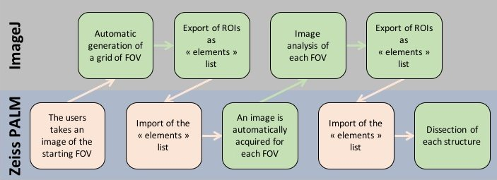
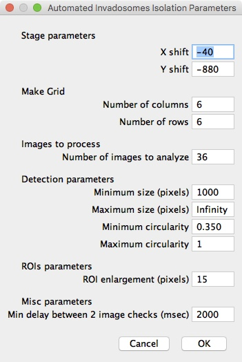
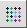
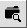

# IJ PALM Zeiss workflow

*An ImageJ workflow for semi-automated laser microdissection using Zeiss PALM system*

## Overview
### IJ PALM Zeiss workflow, the tools
This workflow is composed of:
* An __ImageJ plugin__, PALM_Zeiss.jar (available from the [release page](https://github.com/fabricecordelieres/IJ_PALM_Zeiss_workflow/releases)): its purpose is to convert the ROI Manager's content into Elements' list (input format for the microdissecton system) and the reverse way round. It also embarks a tool to fuse two Elements' list.
* An __ImageJ toolset__, PALM_Zeiss_Toolset-v1.0.txt  (also available from the [release page](https://github.com/fabricecordelieres/IJ_PALM_Zeiss_workflow/releases)): it automates the full process (see the detailed description below).

### IJ PALM Zeiss workflow, a description
The __IJ PALM Zeiss workflow__ has been designed with the end-user in mind, trying to automate as much as possible the process of finding and dissecting subcellular structures of interest. In this process, we had to deal with the absence of an API (Application Programming Interface) for the Zeiss PALM software, which left us working only with the default software input/output, namely images and Elements' files. As a consequence, although most of the steps are automated, some require the user to manually import files in the Zeiss PALM software. The following diagram presents the full workflow:

First, the user uses the software capability to generate images after a cut to export the current position's coordinates. Stage's coordinates are saved as metadata within the exported file. This first "cut" is not a regular microdissection event: the user places a single cut point on the current field, and launches the dissection to create an image, which will carry the positional information.

ImageJ has been set so that any incoming file (/Grid subfolder, see below), within the defined folder, is analysed: knowing the current position, the image's dimensions and spatial calibration, ImageJ uses the PALM_Zeiss plugin to generate and export a grid of coordinates. This steps avoids user-introduced bias in picking the fields of interest. An Elements' file is generated, to be re-imported into the Zeiss PALM software.

The auto-generated Elements' file contains single dots centered over contiguous fields of view. Once reimported, the user launches the "dissection", having set the output folder for image collection to /Elements subfolder (see below). As the images are collected, ImageJ monitors the arrival of new images and processes them: each new image triggers creation of a new Elements' file, nammed after the image. As soon as two Elements' files have been created, they are fused (using the PALM_Zeiss plugin) into a "\_Pulled-Elements.txt" file. This way, all structures to be microdissected are described within a unique file.

Finally, to launch the final subcellular structures' microdissection, the user imports this "\_Pulled-Elements.txt" file to the Zeiss PALM software.

### IJ PALM Zeiss workflow, in action
The following movie recapitulates a typical use of the workflow:

## Installation
1. Download the __PALM_Zeiss.jar plugin__ from the [release page](https://github.com/fabricecordelieres/IJ_PALM_Zeiss_workflow/releases).
2. Drag-and-drop it to the ImageJ toolbar: a dialog box will pop-up, requesting the user to point at the destination folder. By default, the ImageJ/Plugins folder should be selected: press Ok to validate.
3. Download the __PALM_Zeiss_Toolset-v1.0.txt toolset__ from the [release page](https://github.com/fabricecordelieres/IJ_PALM_Zeiss_workflow/releases).
4. Copy and paste the file to your __ImageJ/Macros/Toolset folder__. By clicking on the red arrows (right-most tool of ImageJ's toolbar), the toolset should now be listed. To use it, select it from the list. On the toolbar, the last buttons should now have been replaced by the PALM Zeiss Toolset's ones. NB: To go back to default buttons' display, select "Startup macro" from the list.

## How to use it ?

The __PALM_Zeiss_Toolset-v1.0.txt toolset__ is composed of 6 individual tools, to be used in turn. The first tools are designed to help the use to set experimental parameters while the last ones will start/stop the analysis.

1.  __Full Process:__ This first button automates the full process by fulfilling the following operations:
    1. The user is requested to point at an input folder.
    2. The parameters' dialog box pops-up (see below for more details).
    3. The toolset creates in the input folder two sub-folders and waits for some user-inputs:
        * __Grid__ subfolder: Instead of asking the user to manually input the fields to be analysed, the toolset allows generating a grid of points, centered over the X by Y fields to be evaluated. It only requires one field of view to have been acquired. The toolset waits for an image file to be created within this folder. From its metadata, it will generate an Elements list, placing one dot in the center of each field to be analysed. Therefore, from the Zeiss PALM software, the user has to first set the software to acquire an image after dissection, and enter this /Grid folder as an output folder.
        * The Elements' list, defining the fields of interest, has been automatically generated: the user can now import this element list into the Zeiss PALM software and re-launch dissection for the fields' images to be acquired. The toolset has automatically switched from monitoring the "/Grid" subfolder to monitoring the "/Elements" subfolder. __Caution:__ Do not forget to set the latter as the output subfolder within the Zeiss PALM software !
        * __Elements__ subfolder: This subfolder will accommodate the images of each single field from the grid. As images are acquired, the toolset segments the images, pushes detections' outlines to the ROI Manager and converts them to Elements' files. As one Elements' file is created per image (named after the image's name), once two such files have been generated they are fused (\_Pulled-Elements.txt) in one file to ease the process of re-importing ROIs into the Zeiss PALM software.
        * As the user is now provided with a unique Elements' file containing the location of all detected items, its last task is to reimport the "__\_Pulled-Elements.txt__" to the Zeiss PALM software and start the actual microdissection process.

2.  __Set Parameters:__ This user-interface provides a way to tune mainly the detection parameters:

  

  * _Stage parameters_: Coordinates, as extracted from the image's metadata, do are not exactly stage's coordinates. It seems an offset should be introduced. Those two numeric fields should be filled with offset values, to be determined by trial and error. One way to proceed is to take an image, draw a ROI in the Zeiss PALM software and export both files. The image is then imported in ImageJ, the same structure drawn and converted to an Element using the "Zeiss PALM/Zeiss PALM Elements: export from ROI Manager" plugin. Discrepancy between the exported Elements' list and the one generated using ImageJ should give hints about values to be used.
  * _Make grid_: Number of positions, ie rows and columns, to generate for the acquisition grid.
  * _Images to Process_: Maximum number of images to expect, when segmenting the subcellular structures.
  * _Detection parameters_: Morphometric parameters to be used when segmenting the subcellular structures.
  * _ROIs parameters_: This parameters allows putting the actual cut mark away from the structure, to avoid dissecting within the detected object.
  * _Misc parameters_: Number of msecs to wait before checking for the arrival of a new image within the designated folder.

3.  __Create Folders:__ This button allows creating the two normalised output folders, /Grid and /Elements, within the provided input folder.

4.  __Make Grid:__ This function is aimes at generating the acquisition grid, as an Element File. It requires an image to be opened, carrying the proper metadata (ie generated using the Zeiss PALM software), and an output folder to be provided.

5.  __Start Monitoring:__ Starts monitoring the provided input folder for arrival of new images. Each time a new image is acquired, this tools analyses it and generates the corresponding Elements file. Once two images have been analysed, the second Elements' list is pulled to the __\_Pulled-Elements.txt__ file.

6.  __Stop Monitoring:__ Stops the macro.

## How to test the analysis workflow offline ?
In order to test the workflow offline, the user has to be able to re-create conditions where images are regularly generated and saved into an output folder. This part of the process can be handled using the [IJ_LiveFeed_Simulator](https://github.com/fabricecordelieres/IJ_LiveFeed_Simulator) plugin, using pre-acquired images. As an alternative to using existing images, [example images](/Test_Data/Test_Data.zip) are also provided.
This procedure allows testing only the part of the workflow involved in analysing the images and exporting the Elements' file. Import of the latter should be tested on the actual machine, using the Zeiss PALM software.
